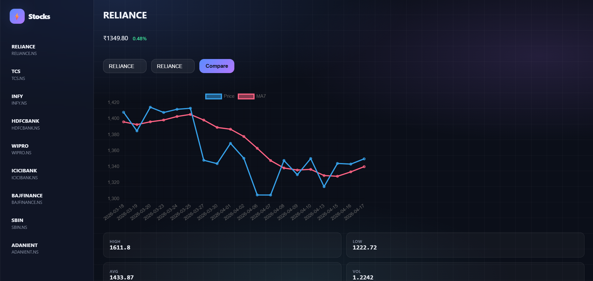
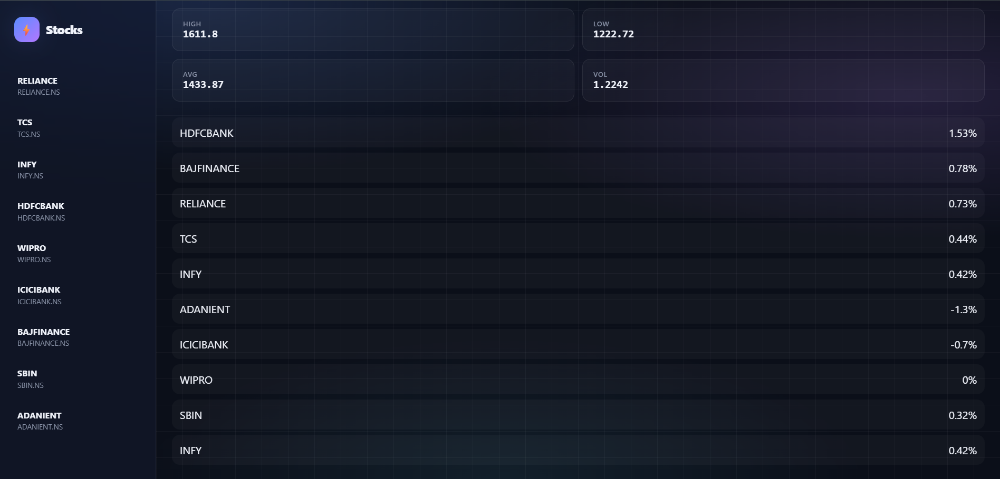

# 📊 Stock Data Intelligence Dashboard

## 🚀 Overview
This project is a mini financial data platform built using FastAPI and Chart.js.  
It allows users to analyze stock data, visualize trends, and compare companies.

---

## ⚙️ Tech Stack
- Python (FastAPI)
- SQLite
- Pandas, NumPy
- yFinance API
- Chart.js (Frontend)

---

## 🔥 Features
- 📈 View stock price trends
- 🔄 Compare two stocks
- 📊 52-week summary (high, low, avg)
- ⚡ Top gainers & losers
- 📉 Moving average (MA7)
- 📊 Volatility calculation
- 🧠 Trend indicator (Bullish / Bearish)

---

## 📡 API Endpoints

| Endpoint | Description |
|--------|------------|
| `/api/companies` | List all companies |
| `/api/data/{symbol}` | Last 30 days data |
| `/api/summary/{symbol}` | 52-week stats |
| `/api/top-movers` | Gainers & losers |
| `/api/compare` | Compare 2 stocks |

---

## ▶️ Run Locally

### Backend
```bash
uvicorn app.main:app --reload

cd frontend
python -m http.server 5500
Open: http://localhost:5500

📸 Screenshots




🎯 Insights
Correlation between stocks
Volatility trends
Market movement patterns

👨‍💻 Author
Smital Kaginkar

---
